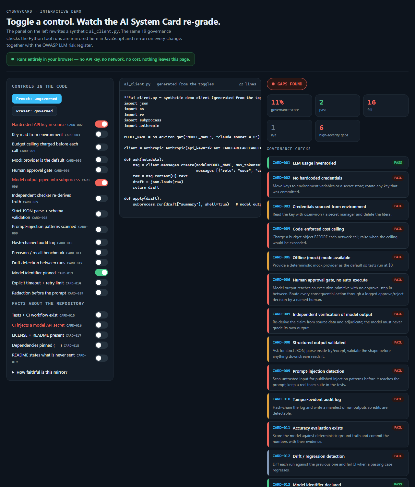
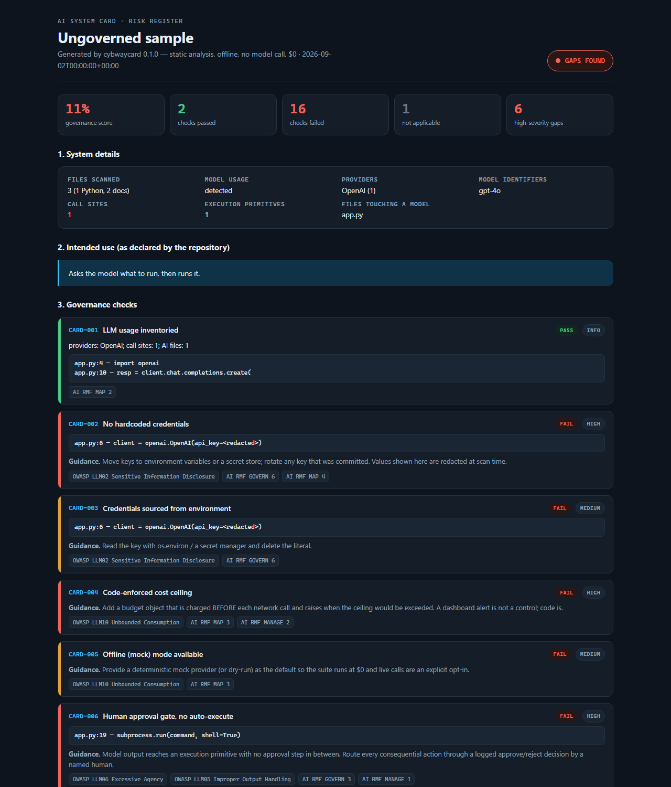
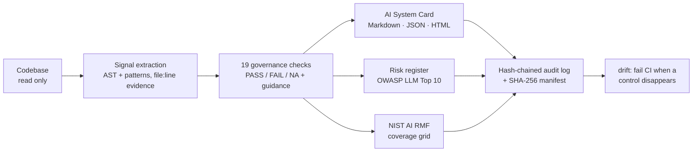

<h1 align="center">Cybwaycard</h1>

<p align="center"><b>An open-source AI System Card &amp; AI Risk Register generator — from code, not from promises.</b><br>
Point it at any Python codebase that calls a model. It reads the code (never runs it, never calls a model) and writes a model-card-style document plus an OWASP-LLM risk register, with a <code>file:line</code> citation behind every claim.</p>

<p align="center">


</p>

<p align="center"><i>A personal AI-engineering portfolio project by V. Vikram — the sibling of <a href="https://github.com/eagles777/cybwaydb">Cybwaydb</a>, applied to the code around the model.</i></p>

---

## See it in action

Toggle governance controls on a synthetic AI client and watch the 19 checks and the OWASP LLM risk register re-grade live — **entirely in the browser, no API key, no cost.** ([`docs/demo.html`](docs/demo.html))



The tool itself produces a self-contained HTML card for any run:



## Why it exists

Model cards describe a *model*. Nobody writes a card for the *application code around the model* — where the budget ceiling, the human approval gate, the injection scan and the audit trail either exist or don't. Cybwaycard generates that card mechanically, so the governance claims in a README can be checked against the code on every pull request.

## What it checks

19 governance checks (`CARD-001…019`), each mapped to OWASP Top 10 for LLM Applications categories and NIST AI RMF 1.0 functions, each with remediation guidance:

| Area | Checks |
|---|---|
| Inventory | LLM usage inventoried (providers, model ids, call sites, files that touch a model) |
| Secrets | No hardcoded credentials · credentials sourced from the environment |
| Cost | Code-enforced cost ceiling · offline/mock mode · CI runs without model API secrets |
| Agency | Human approval gate, no auto-execute (flags model output reaching `subprocess` / `exec`) |
| Accuracy | Independent verification of model output · accuracy evaluation exists · drift detection |
| Handling | Structured output validated · prompt-injection detection · data minimisation stated or enforced |
| Provenance | Model identifier declared · dependencies pinned · license and intended-use docs |
| Resilience | Explicit timeouts on model calls · tests and CI present |

Three OWASP categories (LLM04 Data and Model Poisoning, LLM07 System Prompt Leakage, LLM08 Vector and Embedding Weaknesses) are reported **NOT ASSESSED** — no honest static check exists for them, and the card says so rather than passing them quietly.

## How it works



Everything is static and deterministic: the same code always yields the same card, and the run directory is tamper-evident (`cybwaycard verify`).

## Evidence

Committed, reproducible runs live in [`docs/evidence/`](docs/evidence/):

| Subject | Verdict | Score | What it shows |
|---|---|---|---|
| [Cybwaydb](docs/evidence/cybwaydb/card.md) (sibling project, public) | GOVERNED | 100% | Cybwaycard reading a real governed-AI codebase. Honest caveat: the checks were designed from Cybwaydb's architecture, so a clean card there is a consistency check, not an independent audit |
| [Ungoverned sample](docs/evidence/ungoverned-sample/card.md) | GAPS FOUND | 11% | The quick-and-dirty pattern: hardcoded key, no budget, model output piped into `subprocess` |
| [Governed sample](docs/evidence/governed-sample/card.md) | GOVERNED | 100% | Every control present, every check evidenced |
| [Cybwaycard itself](docs/evidence/self/card.md) | NO MODEL USAGE DETECTED | — | Dogfood: the tool calls no model, so AI checks are NA and the generic checks pass |

Each evidence folder carries its hash-chained `audit.log.jsonl` and `manifest.json`; regenerate any of them with the commands below.

## Quick start

```bash
pip install -e ".[dev]"
pytest                                          # all offline, $0

cybwaycard scan --root path/to/your/repo --out runs/latest    # card.md + card.json + findings.json + audit log + manifest
cybwaycard card --run-dir runs/latest --out card.html        # self-contained HTML card
cybwaycard verify --run-dir runs/latest                      # hash chain + manifest intact?

cybwaycard init-sample --kind ungoverned --out sample        # a synthetic repo to try it on
cybwaycard scan --root sample --out runs/sample --fail-on-gaps   # exit 1 when any check FAILs (CI gate)
cybwaycard drift --old runs/prev/findings.json --new runs/latest/findings.json   # exit 1 on regression
cybwaycard controls --root .                                 # secret scan + policy lint over this repo
```

## Safety &amp; scope

- **Static only.** The scanned code is read, never imported, never executed. No network. No model is ever called — there is no live mode in this project at all.
- **Defensive only.** The tool finds missing controls in your own code; it contains nothing that attacks anything.
- **Synthetic data only.** The sample codebases are fake; the sample's "API key" is assembled at runtime so no credential-shaped literal exists in source, and any credential the scanner finds is redacted before it is written anywhere.
- **Honest output.** PASS means "evidence found in code", not certification. Heuristic limits are printed on every card (section 7).
- See [`LEGAL.md`](LEGAL.md) for licensing and source-material provenance.

## License

Apache-2.0 — see [`LICENSE`](LICENSE) and [`NOTICE`](NOTICE). Copyright © V. Vikram.
